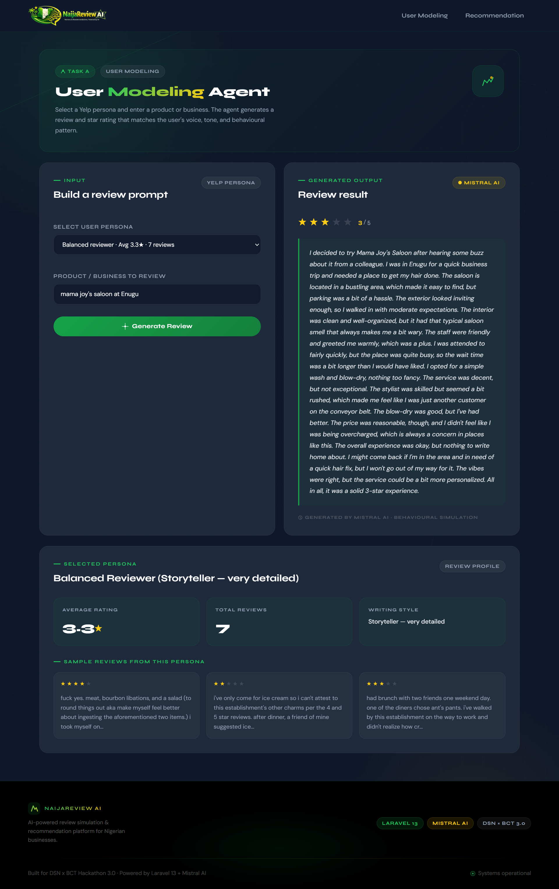

# NaijaReview AI
### DSN x BCT LLM Agent Challenge 3.0

AI-powered behavioural user simulation and personalised 
recommendation system built on Laravel 13 and Mistral AI.




## What It Does

**Task A — User Modeling**
Select a real Yelp user persona. Enter any product or 
business. The agent generates a star rating and written 
review that matches that user's exact voice, tone, and 
behavioural pattern.

**Task B — Recommendation**
Describe any user. The agent returns 10 personalised 
ranked recommendations. Handles three scenarios:
- Normal user (has review history)
- Cold start (brand new user, no history)
- Cross domain (history in different category)

Supports multi-turn conversational refinement — the agent 
remembers the full conversation and adjusts recommendations 
based on follow-up requests.

---

## Tech Stack

| Layer | Technology |
|---|---|
| Framework | Laravel 13 |
| AI Agent Layer | Laravel AI SDK |
| AI Provider | Mistral AI |
| Frontend | Blade + Tailwind CSS |
| Dataset | Yelp Academic Dataset |
| Container | Docker |

---

## Quick Start (Docker)

### Prerequisites
- Docker Desktop installed
- Mistral API key (get one free at https://console.mistral.ai)
- Yelp dataset downloaded (see Dataset Setup below)

### Run with Docker

```bash
git clone https://github.com/Emenyk/naijareview-ai
cd naijareview-ai
cp .env.example .env
```

Add your keys to `.env`:
```
MISTRAL_API_KEY=your_mistral_key_here
APP_KEY=your_app_key_here
```

To generate APP_KEY:
```bash
php artisan key:generate --show
```

Then run:
```bash
docker compose up --build
```

Open `http://localhost:8000`

---

## Dataset Setup

1. Download the Yelp Open Dataset from:
   **https://www.yelp.com/dataset**

2. Extract the TAR file and place these two files in 
   `storage/app/dataset/`:
```
yelp_academic_dataset_business.json
yelp_academic_dataset_review.json
```

3. Generate the review sample file:
```bash
php artisan tinker
```

Then paste:
```php
$input = fopen(storage_path('app/dataset/yelp_academic_dataset_review.json'), 'r');
$output = fopen(storage_path('app/dataset/reviews_sample.json'), 'w');
$count = 0;
while (($line = fgets($input)) !== false && $count < 20000) {
    fwrite($output, $line);
    $count++;
}
fclose($input);
fclose($output);
echo "Done. $count lines extracted.";
```

---

## API Endpoints

### Task A — User Modeling

**Get available personas:**
```
GET /api/v1/personas
```

**Generate review:**
```
POST /api/v1/task-a/generate

Body:
{
  "persona_id": "user_id_from_personas",
  "product": "Chicken Republic, Lagos"
}

Response:
{
  "rating": 3,
  "review": "I decided to try Chicken Republic..."
}
```

---

### Task B — Recommendation

**Get recommendations:**
```
POST /api/v1/task-b/recommend

Body:
{
  "scenario": "normal",
  "persona_description": "Emeka, 32, Lagos. Loves local food.",
  "domain": "restaurants",
  "location": "Lagos"
}

Response:
{
  "recommendations": [
    {
      "name": "Buka Express",
      "reason": "Matches Emeka's love for local Nigerian food..."
    }
  ]
}
```

**Refine recommendations:**
```
POST /api/v1/task-b/refine

Body:
{
  "refinement": "Show only places above 4 stars",
  "scenario": "normal"
}
```

---

## Project Structure

```
app/
├── Ai/
│   └── Agents/
│       ├── UserModelingAgent.php    ← Task A agent
│       └── RecommendationAgent.php  ← Task B agent
├── Services/
│   ├── DatasetService.php   ← Yelp data layer
│   └── PersonaBuilder.php   ← Persona extraction
├── Helpers/
│   └── NigerianContextFormatter.php ← Cultural layer
└── Http/
    └── Controllers/
        ├── TaskAController.php
        ├── TaskBController.php
        └── Api/
            ├── TaskAApiController.php
            └── TaskBApiController.php

resources/views/tasks/
├── task-a/index.blade.php
└── task-b/index.blade.php
```

---

## Nigerian Context Layer

The system includes an optional Nigerian market 
contextualisation layer that adapts outputs for 
Lagos, Abuja, and Port Harcourt — including 
location-aware prompting, Nigerian English writing 
hints, and cultural business knowledge.

This layer earns bonus marks as specified in the 
DSN x BCT challenge brief.

---

## Team

Built for DSN x BCT LLM Agent Challenge 3.0
Powered by Laravel 13 + Mistral AI
```

---

## Then Push Everything

```bash
git add README.md
git add screenshots/
git add SOLUTION_PAPER.md
git add SOLUTION_PAPER.pdf
git commit -m "docs: final submission - README, screenshots, solution paper"
git push origin main
```
