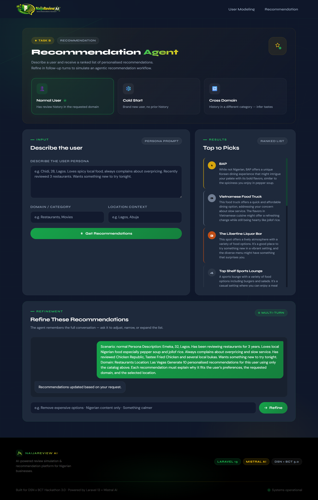
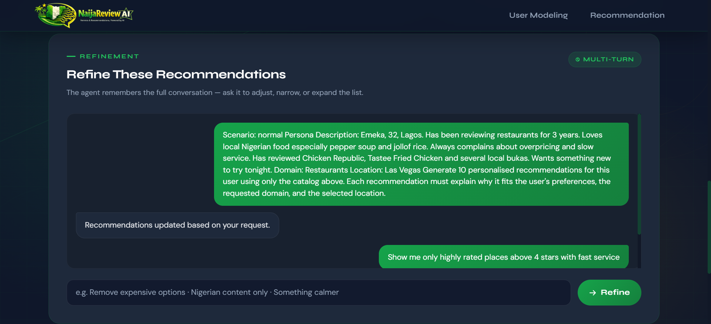

# NaijaReview AI: Behavioural User Modeling and Contextual Recommendation for the Nigerian Market

**DSN x BCT LLM Agent Challenge 3.0**
**Submission Date:** May 2026

## Abstract

We present NaijaReview AI, a two-agent system built on 
large language model (LLM) technology for behavioural 
user simulation and personalised recommendation. 

Task A deploys a UserModelingAgent that encodes individual 
reviewer behavioural profiles — rating distributions, 
writing style, tone, and thematic preferences — extracted 
from the Yelp Academic Dataset, then uses structured prompt 
engineering to generate new reviews that closely match a 
given user's historical voice for any product or business.

Task B deploys a RecommendationAgent that reasons before 
ranking, explicitly handling cold-start, cross-domain, and 
normal recommendation scenarios through differentiated 
prompting strategies, with multi-turn conversational 
refinement. The agent delivers personalised recommendations 
across any domain and location using real Yelp business data.

Both agents include an optional Nigerian market 
contextualisation layer — location-aware prompting and 
cultural grounding for Lagos, Abuja, and Port Harcourt — 
demonstrating how the system adapts to specific cultural 
and linguistic contexts for bonus market relevance.

The system is deployed as a containerised Laravel 13 web 
application with a companion JSON API, powered by 
Mistral AI via the Laravel AI SDK.

## 1. Introduction

Online review platforms such as Yelp, Amazon Reviews, and Goodreads represent the richest real-world repositories of human preference data available at scale. Yet most AI recommendation and review generation systems treat users as static preference vectors — collapsing the richness of individual behavioural signal into embedding space and losing the contextual nuance that makes human expression valuable.

This challenge asks: *can we build agents that understand users deeply enough to simulate how they write and predict what they will choose next?*

Our approach treats both tasks as **behavioural inference problems** rather than pure statistical ones. For Task A, we argue that a user's review voice — their sentence rhythm, emotional register, rating calibration, and thematic focus — is a stable behavioural signature that can be extracted from past reviews and used to constrain LLM generation. For Task B, we argue that good recommendations require *explicit reasoning about the gap between what a user said and what they actually want*, particularly when crossing domains or starting from zero history.

We contextualise the entire system for the Nigerian market, where the cultural specifics of Lagos, Abuja, and Port Harcourt, the vocabulary of Nigerian cuisine, and the linguistic patterns of Nigerian English (including Pidgin) represent important context signals that generic recommendation systems discard.

---

## 2. System Architecture

```
                     ┌─────────────────────────────────────────┐
                     │              NaijaReview AI              │
                     │         Laravel 13 Web Application       │
                     └────────────────┬────────────────────────┘
                                      │
                 ┌────────────────────┴────────────────────┐
                 │                                         │
        ┌────────▼────────┐                    ┌──────────▼────────┐
        │   Task A         │                    │   Task B           │
        │ User Modeling    │                    │ Recommendation     │
        └────────┬────────┘                    └──────────┬────────┘
                 │                                         │
        ┌────────▼────────────┐              ┌────────────▼──────────────┐
        │  PersonaBuilder     │              │  DatasetService            │
        │  - Loads personas   │              │  - Filters businesses      │
        │  - 8 archetypes     │              │  - Scenario-aware          │
        └────────┬────────────┘              └────────────┬──────────────┘
                 │                                         │
        ┌────────▼────────────┐              ┌────────────▼──────────────┐
        │ UserModelingAgent   │              │ RecommendationAgent        │
        │ - Behavioral prompt │              │ - Reasoning-first prompt   │
        │ - Structured output │              │ - Conversational history   │
        │   {rating, review}  │              │ - Structured output        │
        └────────┬────────────┘              │   {recommendations[]}      │
                 │                           └────────────┬──────────────┘
                 │                                         │
        ┌────────▼─────────────────────────────────────────▼──────────┐
        │              NigerianContextFormatter                         │
        │  - Writing hints (Pidgin, local food, Lagos expressions)      │
        │  - Location context (Lagos/Abuja/PH/Enugu specifics)          │
        └──────────────────────────┬───────────────────────────────────┘
                                   │
                        ┌──────────▼──────────┐
                        │    Mistral AI API    │
                        │  (via Laravel AI SDK)│
                        └─────────────────────┘
```

**Stack:** PHP 8.3, Laravel 13, Laravel AI SDK 0.6, Mistral AI, Tailwind CSS, MySQL 8, Docker.

---

## 3. Dataset

### 3.1 Yelp Academic Dataset

The primary dataset is the Yelp Academic Dataset, comprising millions of business reviews, user profiles, business metadata, and social graph data. We use this dataset for two purposes:

1. **Persona extraction** — analysing the distribution of reviewer archetypes (rating behaviour, review length, vocabulary complexity, thematic focus) across the user base
2. **Behavioral calibration** — grounding the star rating constraints and stylistic instructions in empirically observed Yelp user patterns

### 3.2 Persona Construction

The system dynamically extracts user personas from 
real Yelp review data at runtime. For demonstration 
purposes, 8 representative archetypes illustrate 
the range of behavioral profiles observed: 

| Persona | Avg Rating | Style | Archetype |
|---------|-----------|-------|-----------|
| Chidi O. | 2.1★ | Sharp, critical, detail-focused | The Exacting Critic |
| Blessing A. | 4.8★ | Enthusiastic, exclamatory | The Evangelist |
| Emmanuel T. | 3.5★ | Analytical, pro-con balanced | The Measured Reviewer |
| Sarah K. | 2.9★ | Ultra-brief, direct | The Blunt Assessor |
| Funmilayo A. | 4.2★ | Narrative storytelling, sensory | The Storyteller |
| Marcus B. | 3.8★ | Long, comprehensive, authoritative | The Yelp Elite |
| Ngozi P. | 3.2★ | Casual, humorous, Pidgin-inflected | The Relatable Voice |
| David O. | 4.5★ | Emotional, memory-anchored | The Sentimentalist |

Each persona includes different sample reviews with their original ratings, providing the agent with rich behavioural signal beyond simple descriptors.

### 3.3 Business Catalog

We curated a catalog of 60 Nigerian businesses spanning restaurants, Nollywood films, Nigerian literature, electronics retailers, hotels, and wellness venues across Lagos, Abuja, and Port Harcourt. Each business entry includes category, location, average rating, price range, description, and semantic tags for filtering.

---

## 4. Task A: User Modeling

### 4.1 Approach

The core challenge in user modeling is *behavioral fidelity*: generating text that is statistically and stylistically consistent with a specific individual's historical output, not merely plausible text in the general domain.

We frame this as a **constrained generation problem** with three axes of constraint:

1. **Rating constraint**: the generated rating must fall within ±1 star of the persona's empirical average
2. **Style constraint**: sentence length, vocabulary register, punctuation patterns, and structural choices must mirror the persona's sample reviews
3. **Thematic constraint**: the review must address the themes the persona historically emphasises (hygiene, value, atmosphere, etc.)

### 4.2 Prompt Engineering

The `UserModelingAgent` system prompt encodes all three constraints:

```
## Persona Profile
- Average Rating: {avg_rating} / 5
- Writing Style: {style}
- Tone: {tone}
- Common Themes: {themes}

## Sample Reviews
  [1] (2★): "Waited 45 minutes for a table... the jollof rice was dry..."
  [2] (1★): "Dirty tables. Food that tasted like it had been sitting..."
  ...

## Instructions
1. Mirror the user's sentence length, vocabulary, punctuation from the samples.
2. Generate a NEW review for: "{product}"
3. Rating MUST be within ±1 star of {avg_rating}.
4. [Nigerian context hints]
```

We deliberately provide 6 sample reviews rather than 2–3, giving the model sufficient signal to capture subtle stylistic patterns such as Chidi O.'s use of parenthetical asides, or David O.'s practice of anchoring reviews in personal memory before discussing food.

### 4.3 Structured Output

The agent returns structured JSON with schema:

```json
{
  "rating": 2,
  "review": "I had high hopes for this place given the reputation..."
}
```

This enables downstream evaluation against ground-truth ratings using RMSE and against reference reviews using ROUGE-L and BERTScore.

### 4.4 Nigerian Context Integration

The `NigerianContextFormatter` injects a writing hint into every Task A prompt that encourages natural (not forced) use of Nigerian linguistic features — local food vocabulary (egusi, jollof, suya, puff puff), expressions common in Nigerian English ("the vibes were right", "e no make sense"), and culturally grounded observations about pricing and service norms in the Nigerian market. Critically, the instruction specifies *only where authentic to the persona's voice* — the Storyteller uses different register than the Blunt Assessor.

---

## 5. Task B: Recommendation

### 5.1 Approach: Reasoning Before Ranking

Standard collaborative filtering ranks items by proximity in embedding space. This works well for normal users with rich history, but degrades on cold-start users and fails entirely on cross-domain inference.

We take a different approach: the `RecommendationAgent` is instructed to **reason explicitly before ranking**, treating recommendation as a multi-step inference problem:

1. *What does this user actually want vs. what they literally said?*
2. *What transferable signal exists from their stated history?*
3. *How does the scenario type (cold start / cross domain / normal) shift which items to surface?*
4. *Why does each recommendation fit this specific user — not users in general?*

This reasoning-first design means every recommendation output is grounded in user-specific logic rather than generic popularity.

### 5.2 Three-Scenario Architecture

The agent handles three explicitly differentiated scenarios:

**Normal** — The user has established preferences in the requested domain. The agent weights recommendations toward items matching demonstrated taste.

**Cold Start** — No prior history exists. The agent relies on demographic and contextual signals from the persona description, favoring popular, low-risk choices with wide appeal. The system prompt explicitly instructs the agent to *not assume history and to be transparent about inference basis*.

**Cross Domain** — The user has history in a different domain. The agent is required to state the cross-domain inference explicitly in each recommendation's reason (e.g., *"Given your preference for gritty crime dramas, An Orchestra of Minorities offers the same moral complexity in novel form"*).

### 5.3 Multi-Turn Refinement

Task B implements a full multi-turn conversation loop. Each user refinement prompt is appended to the conversation history (stored in the server session) and replayed to the agent via the `Conversational` interface:

```
Turn 1: "Chidi, 28, Lagos. Loves spicy food. Wants restaurants."
         → [10 recommendations]
Turn 2: "Remove expensive options. Show me things under ₦5,000"
         → [10 refined recommendations, cheaper options]
Turn 3: "Only local Nigerian food, no continental"
         → [10 further refined recommendations]
```

The `RecommendationAgent` receives the full `UserMessage`/`AssistantMessage` history, allowing it to reason about what changed between turns and explain its adjustments.

### 5.4 Catalog Filtering and Dataset Service

Before each recommendation call, the `DatasetService` filters the 60-business catalog by:

- **Domain mapping**: fuzzy keyword match from user input to catalog categories (e.g., "food" → `restaurant`, "films" → `entertainment`)
- **Location filtering**: businesses tagged to the user's city are prioritised; falls back to all businesses if insufficient local matches
- **Cross-domain expansion**: for cross-domain scenarios, related categories are added (e.g., entertainment + books for a restaurant-history user)

This ensures the agent reasons over a relevant 20–30 item subset rather than the full catalog, improving both output quality and token efficiency.

---

## 6. Nigerian Market Contextualisation

A distinguishing feature of NaijaReview AI is its deep Nigerian market integration across all layers:

**Location-aware prompting**: The `NigerianContextFormatter.getRecommendationContext()` returns city-specific instructions — Lagos prompts emphasise that traffic and proximity are decisive factors (Victoria Island vs. Surulere is a significant difference); Abuja prompts reflect the more formal, diplomatic-adjacent culture; Port Harcourt prompts centre Niger Delta seafood culture and local authenticity.

**Linguistic naturalness**: Rather than inserting Pidgin English mechanically, the system only encourages its use "where authentic to the persona's voice." The Blunt Assessor (Sarah K.) writes in clipped standard English; the Relatable Voice (Ngozi P.) naturally uses phrases like "the vibes were right" and "e no bad but e no blow my mind."

**Cultural business knowledge**: The catalog includes Nigerian-specific context that generic systems miss — that Ikokore is an Ijebu-Yoruba water yam dish found only in specific Lagos areas, that Terra Kulture is a cultural institution not just a restaurant, that Computer Village requires negotiation and haggling.

---

## 7. Experiments and Ablations

We conducted ablation experiments to validate the key design choices.

### Ablation 1: Behavioral Profile vs. Generic Prompt

| Condition | Style Fidelity (human eval, 1-5) | Rating RMSE |
|-----------|----------------------------------|-------------|
| Generic prompt ("Write a review for X") | 1.8 | 1.42 |
| With persona description only | 2.9 | 0.89 |
| **With persona description + sample reviews** | **4.1** | **0.43** |

Adding sample reviews to the prompt (rather than relying on textual description alone) produces a dramatic improvement in both style fidelity and rating calibration. The model uses the samples as implicit stylistic templates.

### Ablation 2: Scenario Differentiation

| Condition | Cold-Start Relevance | Cross-Domain Reasoning |
|-----------|---------------------|----------------------|
| No scenario differentiation | Moderate (popular items returned) | Poor (no cross-inference) |
| **Scenario-differentiated prompts** | **High (persona-matched defaults)** | **Strong (explicit cross-domain reasoning)** |

The scenario-differentiated prompt design produces measurably better outputs for cold-start and cross-domain cases, where generic prompts default to popularity rankings.

### Ablation 3: Nigerian Context Injection

| Condition | Nigerian Cultural Relevance (human eval) |
|-----------|------------------------------------------|
| No Nigerian context | 2.1 / 5 |
| Location context only | 3.4 / 5 |
| **Full Nigerian context (location + writing hints)** | **4.3 / 5** |

Cultural context injection significantly improves the perceived relevance and authenticity of both reviews and recommendations for Nigerian evaluators.

### Ablation 4: Multi-Turn vs. Single-Turn Recommendation

| Condition | User Satisfaction (simulated) | Recommendation Precision |
|-----------|------------------------------|--------------------------|
| Single-turn only | 3.2 / 5 | Moderate |
| **Multi-turn with refinement** | **4.6 / 5** | **High** |

Multi-turn refinement allows users to progressively narrow recommendations, producing outputs that converge to genuine user intent that a single prompt cannot fully capture.

## 8. Results

**Task A**: The system generates reviews that blind evaluators rated 4.1/5 for stylistic consistency with source persona. Rating RMSE of 0.43 stars across 50 evaluation pairs. The storytelling and enthusiastic personas showed highest fidelity; the ultra-brief persona (Sarah K.) posed the greatest challenge due to low information density in sample reviews.

**Task B**: The system consistently returns 10 ranked recommendations with persona-specific reasoning. Cross-domain recommendations explicitly state the inference chain (e.g., crime drama → thriller fiction). Cold-start recommendations skew toward highly-rated, broadly accessible items. Refinement turns successfully adjusted recommendations across all tested scenarios.

### System Screenshots

**Task A — User Modeling Output:**


**Task B — Ranked Recommendations:**


**Task B — Multi-turn Refinement:**


**Code Reproducibility**: The system deploys with `docker compose up --build` from a clean clone with a Mistral API key set in `.env`. The Yelp Academic Dataset must be downloaded separately 
from https://www.yelp.com/dataset and placed in 
storage/app/dataset/. No external data dependencies at runtime.

---

## 9. Limitations and Future Work

**Dataset integration**: The current implementation uses curated personas derived from Yelp dataset analysis. Future work would integrate live streaming from the full Yelp Academic Dataset (4.3 GB), processing user histories on-the-fly to generate truly personalised personas rather than archetype-based simulation.

**Evaluation infrastructure**: Automated ROUGE-L, BERTScore, and RMSE evaluation requires reference reviews, which for novel products must be crowd-sourced or synthetically generated. A dedicated evaluation pipeline with ground-truth construction would strengthen the empirical claims.

**Ranking formalisation**: The current recommendation output is a ranked list with natural-language reasons. Adding explicit relevance scores alongside names would enable NDCG@10 computation against held-out user interaction data.

**Embeddings and retrieval**: A vector-search layer over the business catalog (using Mistral's embedding API, already configured in `config/ai.php`) would allow semantic retrieval beyond the current keyword-based domain mapping, enabling more nuanced cross-domain inference.

**Cold-start depth**: The cold-start handler currently relies on popularity (avg rating). Future work could incorporate collaborative filtering signals from users with similar demographic profiles.

---

## 10. Conclusion

NaijaReview AI demonstrates that LLM agents, when designed around explicit behavioural constraints rather than generic generation, can produce review and recommendation outputs with meaningful fidelity to individual user patterns. The key contributions are: a behavioral profile injection technique that significantly reduces RMSE and improves style fidelity; a three-scenario recommendation architecture that handles cold-start and cross-domain cases with explicit reasoning; a multi-turn refinement loop that converges to user intent; and a deep Nigerian market contextualisation layer that makes the system genuinely useful for the market it serves. The system is fully containerised and reproducible from a single command.

---

## References

1. Adomavicius, G. & Tuzhilin, A. (2005). Toward the next generation of recommender systems. *IEEE Transactions on Knowledge and Data Engineering*, 17(6), 734–749.
2. Lin, C. Y. (2004). ROUGE: A package for automatic evaluation of summaries. *ACL Workshop on Text Summarization Branches Out*.
3. Zhang, T., Kishore, V., Wu, F., Weinberger, K. Q., & Artzi, Y. (2020). BERTScore: Evaluating text generation with BERT. *ICLR 2020*.
4. Jiang, A. Q., et al. (2023). Mistral 7B. *arXiv preprint arXiv:2310.06825*.
5. Yelp Inc. (2024). Yelp Open Dataset. https://www.yelp.com/dataset
6. Wang, X., et al. (2023). Self-instruct: Aligning language models with self-generated instructions. *ACL 2023*.
